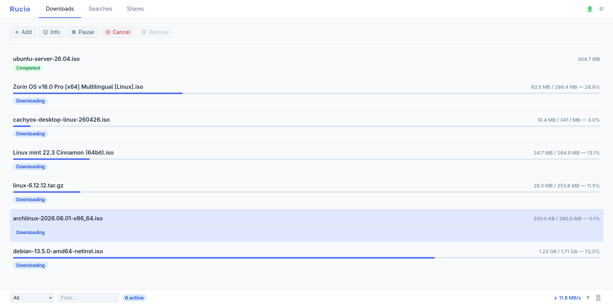

# Rucio

A decentralized peer-to-peer file sharing application built in Rust, inspired by
eMule and MLDonkey and adapted to modern infrastructure.

No trackers. No central servers. No relay nodes for data transfer.
Files are discovered via a distributed hash table (Kademlia DHT) and keyword
search (Gossipsub), and transferred directly between peers. A web control panel
and a full command-line client ship in the box, and Rucio can optionally bridge
to the **eMule / Kad2** network to download `ed2k://` files.

<p align="center">
  
</p>

## Features

- **Fully decentralized** — peers discover each other via mDNS (local network)
  and Kademlia DHT (internet)
- **Web control panel** — manage shares, searches and downloads from the
  browser; served by the daemon itself, no separate process
- **Command-line client** — scriptable `rucio` CLI for shares, searches,
  downloads and node status, locally or against a remote daemon
- **eMule / Kad2 compatibility** *(opt-in)* — search the Kad network and
  download `ed2k://` links alongside native Rucio transfers
- **Magnet links** — share any file with a single `rucio:<hash>` link, entirely
  offline if desired
- **Resumable downloads** — interrupted transfers pick up where they left off
  after a restart
- **Directory sharing** — add a directory and every file inside is indexed,
  hashed, and announced automatically
- **HighID / LowID** — nodes behind NAT can still download; publicly reachable
  nodes serve chunks to everyone
- **Single binary** — `rucio` acts as both daemon (`ruciod`) and CLI depending
  on how it is invoked

## Quick install

### Container (recommended)

Pre-built images are published to `ghcr.io/ogarcia/rucio`. The default `latest`
tag is the complete client — daemon, CLI, embedded web panel and eMule support:

```sh
docker run -d --name rucio \
  -e RUCIOD_API_LISTEN=0.0.0.0:3003 \
  -v rucio-data:/var/lib/rucio \
  -p 3003:3003/tcp \
  -p 4321:4321/tcp \
  -p 4662:4662/tcp \
  -p 4672:4672/udp \
  ghcr.io/ogarcia/rucio:latest
```

Ports: `3003` web panel + API, `4321/tcp` the Rucio libp2p network, and
`4662/tcp` + `4672/udp` eMule/Kad2. Map the eMule ports so the node is reachable
(High-ID) — without them eMule still works but downloads are much slower
(Low-ID), and you can drop them entirely if you don't use eMule.

Then open `http://localhost:3003/` for the panel. Other flavors are available —
`latest-headless` (daemon only), `latest-cli` (standalone client) and
`latest-bootstrap` (DHT bootstrap node). See the
[installation guide](docs/user/01-installation.md) for the full matrix.

### From a release binary

Download the archive for your platform from the [Releases](../../releases)
page, unpack it and place the binary on your PATH:

```sh
tar -xzf rucio-*-x86_64-unknown-linux-musl.tar.gz
install -m755 rucio /usr/local/bin/rucio
ln -s /usr/local/bin/rucio /usr/local/bin/ruciod
```

The release binary is the complete client with the web panel and eMule support
built in.

### From source

Requires Rust 1.85 or later (uses the 2024 edition).

```sh
git clone https://github.com/ogarcia/rucio
cd rucio
cargo build --release
install -m755 target/release/rucio /usr/local/bin/rucio
ln -s /usr/local/bin/rucio /usr/local/bin/ruciod
```

A plain build gives the daemon and CLI. Add `--features emule-compat` for eMule
support and `--features web-ui` for the embedded panel — see the
[installation guide](docs/user/01-installation.md#option-b--build-from-source)
for the details (the panel also needs the Leptos frontend built with `trunk`).

## Five-minute walkthrough

**Start the daemon** (keeps running in the foreground; use a service manager or
`tmux`/`screen` for persistent operation):

```sh
ruciod
```

If your build includes the web panel, it is now at `http://127.0.0.1:3003/` —
everything below can be done from there too.

**Share a directory:**

```sh
rucio share add ~/Movies
```

**Check what you are sharing:**

```sh
rucio share list
```

**Search the network** (`--wait` blocks until results come in):

```sh
rucio search add --wait "big buck bunny"
```

**Download a result** (by index from the last search, or by magnet / ed2k link):

```sh
rucio download add 1
rucio download add "rucio:abc123...?name=big_buck_bunny.mkv&size=734003200"
```

**Watch progress:**

```sh
rucio download list --watch
```

**Get a magnet link to share with someone:**

```sh
rucio share magnet 1          # by row number from `rucio share list`
rucio share magnet --file /path/to/file.mkv   # offline, no daemon needed
```

## Documentation

| Guide | Description |
|---|---|
| [User guide](docs/user/README.md) | Installation, configuration and everyday usage |
| [Admin guide](docs/admin/README.md) | Running bootstrap nodes and the DHT indexer |
| [Design docs](docs/design/README.md) | Architecture, protocols and implementation decisions |
